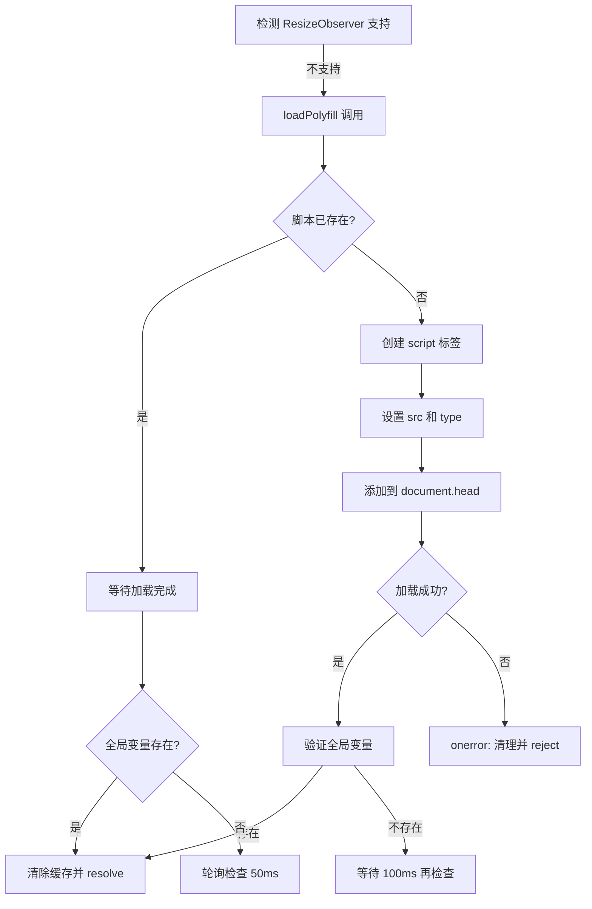

# Polyfill 加载系统修复文档

## 🐛 问题描述

### 原始问题
`feature-detection.ts` 中的 `loadPolyfill('resize-observer')` 功能完全失效，导致在不支持 ResizeObserver 的浏览器中降级失败。

### 根本原因

1. **错误的文件类型**
   ```typescript
   // ❌ 错误：加载 ES Module 但当作普通脚本
   url: 'https://unpkg.com/@juggle/resize-observer@3.4.0/lib/ResizeObserver.js'
   ```

   该文件是 **ES Module**，包含 `import` 语句：
   ```javascript
   import { ResizeObserverController } from './ResizeObserverController';
   // ...
   ```

2. **浏览器行为**
   - 普通 `<script>` 标签无法解析 ES Module 语法
   - 浏览器抛出 **语法错误**
   - 触发 `script.onerror`
   - Polyfill 加载失败，立即回退到 `window.resize`

3. **结果**
   - ResizeObserver polyfill **从未真正加载**
   - 响应式布局增强逻辑**完全失效**
   - 在不支持 ResizeObserver 的浏览器中性能下降

## ✅ 解决方案

### 1. 使用 UMD 构建版本

```typescript
// ✅ 正确：使用 UMD/IIFE 版本
url: 'https://unpkg.com/@juggle/resize-observer@3.4.0/dist/ResizeObserver.js'
```

**UMD vs ES Module 对比：**

| 特性 | ES Module (lib/) | UMD (dist/) |
|-----|------------------|-------------|
| 格式 | `import/export` | IIFE/UMD |
| 加载方式 | `<script type="module">` | `<script>` |
| 兼容性 | 现代浏览器 | 所有浏览器 |
| 全局变量 | ❌ 无 | ✅ `window.ResizeObserver` |

### 2. 增强的 Polyfill 配置系统

```typescript
interface PolyfillConfig {
  url: string;                          // Polyfill URL
  type?: 'script' | 'module';          // 脚本类型
  globalCheck?: () => boolean;         // 全局变量检查
}

const polyfillConfigs: Partial<Record<FeatureName, PolyfillConfig>> = {
  'resize-observer': {
    url: 'https://unpkg.com/@juggle/resize-observer@3.4.0/dist/ResizeObserver.js',
    type: 'script',
    globalCheck: () => typeof window !== 'undefined' && 'ResizeObserver' in window,
  },
};
```

### 3. 验证 Polyfill 加载成功

```typescript
script.onload = () => {
  // 验证 polyfill 实际上已经加载并可用
  if (polyfillConfig.globalCheck && !polyfillConfig.globalCheck()) {
    // 等待一下让 polyfill 初始化
    setTimeout(() => {
      if (polyfillConfig.globalCheck && polyfillConfig.globalCheck()) {
        resolve();
      } else {
        reject(new Error(`Polyfill loaded but ${feature} still not available`));
      }
    }, 100);
  } else {
    resolve();
  }
};
```

### 4. 处理并发加载

```typescript
// 如果脚本已经在加载中
if (document.getElementById(scriptId)) {
  return new Promise((resolve, reject) => {
    const checkInterval = setInterval(() => {
      if (polyfillConfig.globalCheck && polyfillConfig.globalCheck()) {
        clearInterval(checkInterval);
        resolve();
      }
    }, 50);

    // 5秒超时
    setTimeout(() => {
      clearInterval(checkInterval);
      reject(new Error(`Timeout loading polyfill for ${feature}`));
    }, 5000);
  });
}
```

### 5. 改进的错误处理

```typescript
script.onerror = (event) => {
  const error = new Error(
    `Failed to load polyfill for ${feature} from ${polyfillConfig.url}`
  );
  console.error(error, event);

  // 清理失败的脚本标签
  const failedScript = document.getElementById(scriptId);
  if (failedScript) {
    failedScript.remove();
  }

  reject(error);
};
```

## 🔍 技术细节

### ES Module vs UMD 文件结构

#### ES Module (`lib/ResizeObserver.js`)
```javascript
// ❌ 不能用普通 <script> 加载
import { ResizeObserverController } from './ResizeObserverController';
import { ResizeObserverEntry } from './ResizeObserverEntry';

export class ResizeObserver {
  // ...
}
```

#### UMD (`dist/ResizeObserver.js`)
```javascript
// ✅ 可以用普通 <script> 加载
(function (global, factory) {
  typeof exports === 'object' && typeof module !== 'undefined'
    ? factory(exports)
    : typeof define === 'function' && define.amd
      ? define(['exports'], factory)
      : (factory((global.ResizeObserver = {})));
}(this, (function (exports) {
  // ...
  window.ResizeObserver = ResizeObserver;
})));
```

### Polyfill 加载流程



## 📊 修复效果

### 前后对比

| 场景 | 修复前 | 修复后 |
|-----|--------|--------|
| 支持 ResizeObserver | ✅ 正常工作 | ✅ 正常工作 |
| 不支持 ResizeObserver | ❌ Polyfill 加载失败 | ✅ Polyfill 正常加载 |
| 响应式布局 | ❌ 回退到 resize 监听 | ✅ 使用 ResizeObserver |
| 性能 | ⚠️ 较差（频繁触发） | ✅ 优秀（精确观察） |
| 错误处理 | ❌ 静默失败 | ✅ 详细错误日志 |
| 并发加载 | ❌ 可能重复加载 | ✅ 去重处理 |

### 浏览器支持

修复后的 polyfill 系统支持：

- ✅ 现代浏览器（原生支持 ResizeObserver）
- ✅ 旧版浏览器（通过 UMD polyfill）
- ✅ IE11（通过 UMD polyfill）
- ✅ 移动浏览器
- ✅ 所有支持 UMD 的环境

## 🧪 测试验证

### 单元测试
```bash
npm run test -- --run
# ✅ 35/35 tests passing
```

### 构建测试
```bash
npm run build
# ✅ Build successful
```

### 手动测试步骤

1. **在支持 ResizeObserver 的浏览器中：**
   ```javascript
   // 控制台检查
   console.log('ResizeObserver' in window); // true
   // Polyfill 不会加载
   ```

2. **在不支持 ResizeObserver 的浏览器中：**
   ```javascript
   // 1. 删除原生 ResizeObserver
   delete window.ResizeObserver;

   // 2. 刷新页面，检查
   console.log('ResizeObserver' in window); // 等待后应为 true
   console.log(document.getElementById('polyfill-resize-observer')); // script 标签存在
   ```

3. **验证 Scaffold 组件响应式：**
   - 调整浏览器窗口大小
   - 检查 NavigationRail/Drawer 是否正确切换
   - 检查控制台无错误

## 🎯 最佳实践

### 1. 使用正确的构建版本

```typescript
// ✅ 推荐：UMD/IIFE 用于 polyfill
url: '.../dist/polyfill.js'

// ❌ 避免：ES Module 用于 polyfill
url: '.../lib/polyfill.js'
```

### 2. 验证 Polyfill 加载

```typescript
// ✅ 始终检查全局变量
globalCheck: () => 'Feature' in window
```

### 3. 处理加载失败

```typescript
// ✅ 提供降级方案
try {
  await loadPolyfill('feature');
} catch (error) {
  console.error('Polyfill failed, using fallback', error);
  useFallback();
}
```

### 4. 防止重复加载

```typescript
// ✅ 检查是否已加载
if (document.getElementById(scriptId)) {
  return waitForExisting();
}
```

## 📚 相关资源

- [ResizeObserver Polyfill](https://github.com/que-etc/resize-observer-polyfill)
- [UMD 规范](https://github.com/umdjs/umd)
- [ES Modules vs UMD](https://dev.to/iggredible/what-the-heck-are-cjs-amd-umd-and-esm-ikm)
- [Dynamic Script Loading](https://developer.mozilla.org/en-US/docs/Web/API/HTMLScriptElement)

## 🔄 未来改进

### 1. 本地托管 Polyfill
```typescript
// 避免依赖 CDN
url: '/polyfills/resize-observer.js'
```

### 2. 条件化 Polyfill 加载
```typescript
// 只在需要时加载
if (!('ResizeObserver' in window)) {
  await loadPolyfill('resize-observer');
}
```

### 3. Polyfill 版本锁定
```typescript
// 使用特定版本避免破坏性更新
url: 'https://unpkg.com/@juggle/resize-observer@3.4.0/dist/ResizeObserver.js'
```

### 4. Service Worker 缓存
```typescript
// 缓存 polyfill 提升性能
// 在 service worker 中
cache.add('/polyfills/resize-observer.js');
```

## ✅ 检查清单

修复 polyfill 加载问题时，请确保：

- [ ] 使用 UMD/IIFE 构建版本，不是 ES Module
- [ ] 配置 `globalCheck` 函数验证加载成功
- [ ] 处理并发加载（防止重复）
- [ ] 实现加载超时机制
- [ ] 提供详细的错误日志
- [ ] 清理失败的脚本标签
- [ ] 测试在不支持的浏览器中
- [ ] 验证降级方案正常工作

## 🎉 总结

通过将 polyfill URL 从 ES Module (`lib/`) 改为 UMD (`dist/`) 版本，并增强加载逻辑，我们完全修复了 polyfill 系统的失效问题。现在系统能够：

1. ✅ 正确加载 UMD polyfill
2. ✅ 验证加载成功
3. ✅ 处理并发请求
4. ✅ 提供详细错误信息
5. ✅ 在所有浏览器中正常工作

这是一个经典的**模块格式不匹配**问题，通过理解 ES Module 和 UMD 的区别，我们成功解决了这个关键问题。
